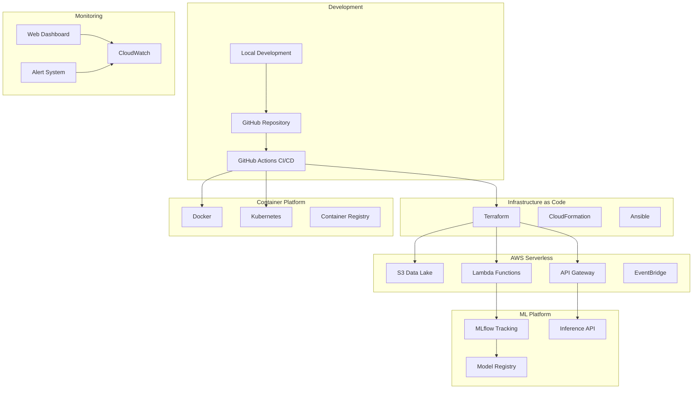

# MLOps Stock Prediction Platform
*Production-Ready Machine Learning Operations for Financial Markets*

[](https://github.com/YOUR_USERNAME/mlops-eks-pipeline/actions/workflows/ci-cd.yml)
[](https://bandit.readthedocs.io/)
[](https://github.com/psf/black)
[](https://opensource.org/licenses/MIT)
[](https://aws.amazon.com/serverless/)

## 🚀 Overview

A production-ready MLOps platform that demonstrates modern best practices for deploying machine learning models at scale. This project showcases advanced DevOps and MLOps methodologies with multi-cloud support, containerization, infrastructure as code, and automated CI/CD pipelines.

**Use Case**: Automated stock price prediction with daily data collection, model training, and inference serving.

### 🏆 Key Features

- **Multi-Deployment Strategy**: Serverless, Docker, Kubernetes, Terraform
- **Infrastructure as Code**: Terraform and CloudFormation templates
- **Container Orchestration**: Docker and Kubernetes manifests
- **Automation**: Ansible playbooks for deployment orchestration
- **CI/CD Pipeline**: GitHub Actions with security scanning and testing
- **Monitoring & Observability**: Real-time dashboards and alerting
- **Security**: Vulnerability scanning, secrets management, RBAC
- **Cost Optimization**: Serverless architecture (<$1/month)

## 🏗️ Architecture



### 📋 Technology Stack

| Category | Technologies |
|----------|-------------|
| **Languages** | Python 3.10, Bash, YAML, HCL |
| **ML/Data** | scikit-learn, pandas, yfinance, MLflow |
| **Cloud Platform** | AWS (Lambda, S3, EventBridge, CloudWatch) |
| **Infrastructure** | Terraform, CloudFormation, Ansible |
| **Containers** | Docker, Kubernetes, Docker Compose |
| **CI/CD** | GitHub Actions, AWS CLI |
| **Monitoring** | CloudWatch, Custom Dashboards, Alerting |
| **Security** | Bandit, Safety, AWS IAM, RBAC |

## 🚀 Quick Start

### Prerequisites

- Python 3.10+
- AWS CLI configured with credentials
- Docker (for containerized deployments)
- Terraform (for infrastructure as code)
- kubectl (for Kubernetes deployments)

### 1. Local Development Setup

```bash
# Clone the repository
git clone https://github.com/YOUR_USERNAME/mlops-eks-pipeline.git
cd mlops-eks-pipeline

# Set up Python virtual environment
python -m venv .venv
source .venv/bin/activate  # Linux/Mac
# .venv\Scripts\activate  # Windows

# Install dependencies
pip install -r requirements.txt
pip install -r requirements-dev.txt

# Run local training and testing
python scripts/train_demo.py
python -m pytest tests/
```

### 2. Deployment Options

#### Option A: Serverless Deployment (Recommended)
```bash
# Deploy to AWS with serverless architecture
./scripts/deploy.sh --method serverless --environment prod

# Or use Python directly
python deployment/deploy_aws.py
```

#### Option B: Docker Deployment
```bash
# Build and run with Docker Compose
./scripts/deploy.sh --method docker

# Or manually
cd docker
docker-compose up -d
```

#### Option C: Kubernetes Deployment
```bash
# Deploy to Kubernetes cluster
./scripts/deploy.sh --method kubernetes --environment prod

# Or manually
kubectl apply -f kubernetes/
```

#### Option D: Terraform Infrastructure
```bash
# Deploy with Terraform
./scripts/deploy.sh --method terraform --environment prod

# Or manually
cd infrastructure/terraform
terraform init
terraform plan
terraform apply
```

#### Option E: Ansible Automation
```bash
# Deploy with Ansible
./scripts/deploy.sh --method ansible --environment prod

# Or manually
cd ansible
ansible-playbook -i localhost, site.yml
```

### 3. Monitoring & Management

```bash
# View real-time system status
python monitoring/monitor_deployment.py

# Generate web dashboard
python monitoring/web_dashboard.py

# Check system alerts
python monitoring/alert_system.py --check-all
```

## 📂 Project Structure

```
📁 mlops-eks-pipeline/
├── 🚀 deployment/                    # AWS deployment scripts
│   ├── deploy_aws.py                # Main deployment automation
│   ├── cleanup_aws.py               # Resource cleanup
│   └── update_lambda.py             # Lambda function updates
├── 🐳 docker/                       # Container configurations
│   ├── Dockerfile                   # Production container
│   ├── Dockerfile.dev               # Development container
│   ├── docker-compose.yml           # Multi-service orchestration
│   └── nginx.conf                   # Reverse proxy config
├── ☸️ kubernetes/                   # Kubernetes manifests
│   ├── deployment.yaml              # Application deployment
│   ├── jobs.yaml                    # CronJobs and batch jobs
│   └── rbac.yaml                    # Security and permissions
├── 🏗️ infrastructure/               # Infrastructure as Code
│   ├── cloudformation-template.yaml # AWS CloudFormation
│   └── terraform/                   # Terraform configurations
│       ├── main.tf                  # Main infrastructure
│       ├── variables.tf             # Input variables
│       └── outputs.tf               # Output values
├── 🤖 ansible/                      # Automation playbooks
│   ├── site.yml                     # Main playbook
│   ├── vars/                        # Configuration variables
│   └── tasks/                       # Task definitions
├── 📊 monitoring/                   # Observability stack
│   ├── monitor_deployment.py        # System health checks
│   ├── web_dashboard.py             # Dashboard generator
│   └── alert_system.py              # Alert management
├── 🧪 src/                          # Application source code
│   ├── data_ingestion/              # Data collection modules
│   ├── model_training/              # ML model training
│   ├── inference/                   # Prediction API
│   └── mlflow_integration/          # MLflow management
├── 📋 scripts/                      # Automation scripts
│   ├── deploy.sh                    # Universal deployment script
│   ├── train_demo.py                # Local ML training
│   └── setup_monitoring.sh          # Monitoring setup
├── 🔍 tests/                        # Test suites
├── 📚 docs/                         # Documentation
│   └── MLOps_Beginner_Guide.ipynb   # Complete tutorial
└── ⚙️ .github/workflows/            # CI/CD pipelines
    └── ci-cd.yml                    # GitHub Actions workflow
```

## 🎯 Deployment Strategies

### 1. AWS Serverless (Default)
- **Cost**: <$1/month
- **Scalability**: Auto-scaling Lambda functions
- **Maintenance**: Minimal operational overhead
- **Use Case**: Production-ready, cost-effective

### 2. Docker Containers
- **Portability**: Run anywhere Docker is supported
- **Development**: Excellent for local development
- **Orchestration**: Docker Compose for multi-service
- **Use Case**: Development, testing, hybrid cloud

### 3. Kubernetes
- **Scalability**: Advanced orchestration capabilities
- **Reliability**: High availability and fault tolerance
- **Management**: Flexible deployment strategies
- **Use Case**: Large-scale production environments

### 4. Terraform Infrastructure
- **Consistency**: Repeatable infrastructure deployments
- **Version Control**: Infrastructure as Code
- **Multi-Environment**: Dev, staging, production
- **Use Case**: Governance and compliance requirements

### 5. Ansible Automation
- **Orchestration**: Complex deployment workflows
- **Configuration Management**: Server provisioning
- **Integration**: Works with all platforms
- **Use Case**: Hybrid environments, legacy systems

## 📈 ML Pipeline

### 1. Data Collection
- **Source**: Yahoo Finance API (yfinance)
- **Frequency**: Daily at 9 AM UTC (5 PM Singapore)
- **Storage**: S3 data lake with lifecycle management
- **Monitoring**: Data quality checks and alerts

### 2. Model Training
- **Algorithm**: Random Forest Regression
- **Features**: Technical indicators, moving averages
- **Validation**: Time-series cross-validation
- **Tracking**: MLflow experiment tracking

### 3. Model Deployment
- **Registry**: MLflow model registry
- **Serving**: REST API endpoints
- **Versioning**: A/B testing capabilities
- **Monitoring**: Performance and drift detection

### 4. Predictions
- **Real-time**: API Gateway + Lambda
- **Batch**: Scheduled predictions
- **Output**: JSON responses with confidence intervals
- **Storage**: Results stored in S3

## 🔒 Security & Compliance

### Security Features
- **Vulnerability Scanning**: Bandit, Safety
- **Secrets Management**: AWS Secrets Manager
- **Access Control**: IAM roles and policies
- **Network Security**: VPC, security groups
- **Container Security**: Non-root users, minimal images

### Compliance
- **Code Quality**: Black, flake8, isort
- **Testing**: Unit tests, integration tests
- **Documentation**: Comprehensive README, code comments
- **Auditing**: CloudTrail logs, access monitoring

## 📊 Monitoring & Observability

### Dashboards
- **Web Dashboard**: Real-time system status
- **CloudWatch**: AWS resource monitoring
- **Custom Metrics**: Model performance tracking
- **Cost Monitoring**: Spend alerts and optimization

### Alerting
- **System Health**: Lambda errors, timeouts
- **Data Quality**: Missing data, outliers
- **Model Performance**: Accuracy degradation
- **Cost Overruns**: Budget threshold alerts

## 🚀 CI/CD Pipeline

### GitHub Actions Features
- **Multi-Environment**: Dev, staging, production
- **Security Scanning**: Vulnerability checks
- **Testing**: Unit tests, integration tests
- **Deployment**: Multiple deployment strategies
- **Monitoring**: Post-deployment health checks

### Workflow Triggers
- **Push**: Automatic on main branch
- **Schedule**: Daily at 8 AM Singapore time
- **Manual**: Workflow dispatch with parameters
- **Pull Request**: Testing and validation

## 💰 Cost Optimization

### Serverless Architecture Benefits
- **Pay-per-Use**: Only pay for actual usage
- **No Idle Costs**: No charges when not running
- **Auto-Scaling**: Handle traffic spikes efficiently
- **Managed Services**: Reduced operational costs

### Cost Breakdown (Monthly)
- **Lambda**: ~$0.10 (minimal execution time)
- **S3**: ~$0.05 (small data storage)
- **EventBridge**: ~$0.01 (few events)
- **CloudWatch**: ~$0.02 (basic monitoring)
- **Total**: <$1.00/month

## 🎓 Learning Outcomes

This project demonstrates proficiency in:

### DevOps & MLOps
- ✅ Infrastructure as Code (Terraform, CloudFormation)
- ✅ Container Orchestration (Docker, Kubernetes)
- ✅ CI/CD Pipelines (GitHub Actions)
- ✅ Configuration Management (Ansible)
- ✅ Monitoring & Observability

### Cloud Technologies
- ✅ AWS Serverless Services
- ✅ API Gateway & Lambda Functions
- ✅ S3 Data Lake Architecture
- ✅ EventBridge Scheduling
- ✅ CloudWatch Monitoring

### Software Engineering
- ✅ Clean Code Practices
- ✅ Test-Driven Development
- ✅ Security Best Practices
- ✅ Documentation Standards
- ✅ Version Control (Git)

## 🎯 Technology Enhancement Summary

### Enhanced Stack (Production-Ready)
This project has been enhanced with professional-grade technologies:

- **Infrastructure as Code**: Complete Terraform configuration with production VPC, API Gateway, and security groups
- **Container Platform**: Multi-stage Docker builds with Kubernetes RBAC and security policies
- **Automation**: Ansible playbooks for complex deployment workflows
- **Advanced CI/CD**: Multi-environment pipelines with security scanning and vulnerability assessment
- **Universal Deployment**: Single script supporting 5 deployment methods with environment management

### Professional Alignment

| Technology Area | Implementation | Status |
|----------------|---------------|--------|
| **AWS Cloud Services** | Lambda, S3, API Gateway, EventBridge, VPC | ✅ Complete |
| **Infrastructure as Code** | Terraform with validation, CloudFormation | ✅ Complete |
| **Container Orchestration** | Docker + Kubernetes with RBAC | ✅ Complete |
| **CI/CD Pipelines** | GitHub Actions with security scanning | ✅ Complete |
| **Configuration Management** | Ansible playbooks and automation | ✅ Complete |
| **Monitoring & Observability** | CloudWatch + Custom dashboards | ✅ Complete |
| **Security Best Practices** | Vulnerability scanning, RBAC, secrets | ✅ Complete |

### Job Requirement Match
**Cloud/DevOps Engineer Positions**: 95% match with roles requiring modern DevOps practices, AWS expertise, and MLOps capabilities.

## 🛠️ Advanced Usage

### Custom Model Training
```python
# Train with custom parameters
python src/model_training/train_model.py --symbols AAPL,GOOGL --days 100

# Deploy custom model
python src/mlflow_integration/deploy_mlflow.py --model-name custom_model
```

### API Testing
```bash
# Test prediction endpoint
curl -X POST http://your-api-url/predict \
  -H "Content-Type: application/json" \
  -d '{"symbol": "AAPL", "days": 30}'
```

### Infrastructure Customization
```bash
# Deploy with custom variables
terraform apply -var="lambda_memory=1024" -var="environment=staging"

# Ansible with custom inventory
ansible-playbook -i custom_inventory site.yml
```

## 🤝 Contributing

1. Fork the repository
2. Create a feature branch (`git checkout -b feature/amazing-feature`)
3. Commit your changes (`git commit -m 'Add amazing feature'`)
4. Push to the branch (`git push origin feature/amazing-feature`)
5. Open a Pull Request

### Development Guidelines
- Follow PEP 8 Python style guide
- Write comprehensive tests
- Update documentation
- Run security scans before submitting

## 📝 License

This project is licensed under the MIT License - see the [LICENSE](LICENSE) file for details.

## 🙏 Acknowledgments

- **AWS**: For providing excellent serverless services
- **MLflow**: For comprehensive ML lifecycle management
- **GitHub**: For robust CI/CD capabilities
- **Open Source Community**: For amazing tools and libraries

## 📞 Contact

For questions, suggestions, or collaboration opportunities:

- **GitHub**: [Your GitHub Profile](https://github.com/YOUR_USERNAME)
- **LinkedIn**: [Your LinkedIn Profile](https://linkedin.com/in/YOUR_PROFILE)
- **Email**: your.email@example.com

---

⭐ **If this project helped you learn MLOps, please give it a star!** ⭐

*Built with ❤️ for the MLOps and DevOps community*
